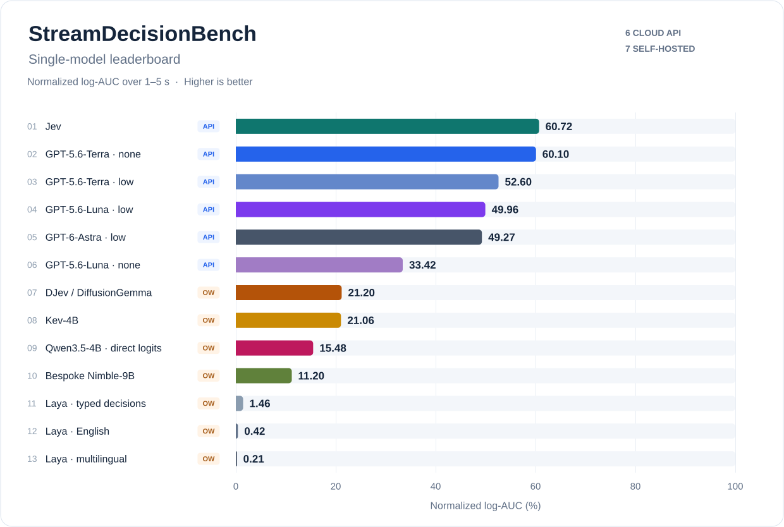
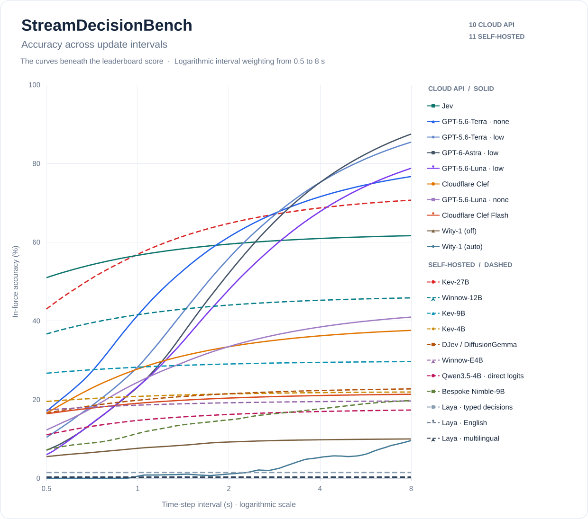

# StreamDecisionBench (SDB)

**Evaluating decisions in force on evolving language streams.**

Language models increasingly run inside applications as decision components: the application
sends the current state, composes the answers into one decision, and keeps applying that decision
until a newer one arrives. While the model is thinking, the world keeps changing, so an answer that
is correct for the state it saw can take effect late and stay in force after the right decision has
changed. Untimed (offline) accuracy counts that answer as correct; the application does not.

SDB evaluates the **decision in force** at every instant. It streams evidence in four application
families, computes reference decisions from public rules with executable code, and attributes every
erroneous instant to **judgment** (wrong for the current state), **latency** (a *stale* decision,
right for an outdated state) or both. The primary score is **normalized log-AUC**: in-force accuracy
averaged over time-step intervals from 0.5 to 8 s on a logarithmic axis.





The curves show in-force accuracy at each update interval; the leaderboard summarizes them with
normalized log-AUC. [Figure data and regeneration](docs/figures/README.md).

<!-- BEGIN GENERATED SDB RESULTS -->
## Results

One pass each for Wity auto/off and three for all other settings, each over all 480 states (8 scenarios in 4 families), recorded at a 2 s
time-step interval. The primary score is normalized log-AUC over 0.5–8 s, with equal scenario weights
within each family and then equal family weights. Interval evaluations retain the recorded answers
and latencies; they assume service latency does not change with the request rate.

The 0.5–8 s domain spans update rates four times faster and slower than the 2 s recording cadence.
Each doubling interval receives equal log weight, balancing faster and slower conditions around that cadence.
These bounds define a controlled evaluation domain; deployment-specific event rates can motivate other ranges.

### Hosted APIs

Latency includes the remote service and internet round trip from the benchmark client.

| Setting | Model | Passes | Mean log-AUC ± SD (%) | Mean untimed (%) | Mean median latency (s) |
|---|---|---:|---:|---:|---:|
| Perplexity Decider v1 27B | `pplx-decider-v1-27b` | 3 | 63.37 ± 0.27 | 70.00 | 0.379 |
| Jev | `jev-latest` | 3 | 58.50 ± 1.10 | 62.36 | 0.232 |
| Terra none | `gpt-5.6-terra` | 3 | 55.46 ± 1.29 | 81.88 | 1.360 |
| Terra low | `gpt-5.6-terra` | 3 | 52.06 ± 3.48 | 95.76 | 2.134 |
| Astra low | `gpt-6-astra` | 3 | 49.51 ± 4.44 | 99.86 | 2.353 |
| Luna low | `gpt-5.6-luna` | 3 | 45.45 ± 0.70 | 89.93 | 2.443 |
| GLiDE (Fastino) | `fastino/GLiDE` | 3 | 39.43 ± 2.11 | 80.49 | 5.546 |
| Claude Haiku 5.5 low | `claude-haiku-5-5` | 3 | 36.56 ± 0.09 | 95.35 | 3.660 |
| GPT-6-Luna (Decisions API) | `gpt-6-luna` | 3 | 32.39 ± 0.70 | 36.04 | 0.344 |
| Clef | `clef` | 3 | 31.39 ± 0.41 | 38.96 | 0.885 |
| Luna none | `gpt-5.6-luna` | 3 | 30.87 ± 1.12 | 43.54 | 1.312 |
| Clef Flash | `clef-flash` | 3 | 19.89 ± 0.19 | 21.67 | 0.437 |
| Claude Haiku 5.5 thinking off | `claude-haiku-5-5` | 3 | 19.38 ± 1.09 | 25.56 | 1.439 |
| Wity-1 (off) | `wity-1` | 1 | 8.61 (one pass) | 10.21 | 1.291 |
| Wity-1 (auto) | `wity-1` | 1 | 2.64 (one pass) | 27.50 | 63.534 |

[Family scores](docs/lite/results/four-family/README.md); [individual hosted passes and repeat variation](docs/lite/results/hosted-api-repeats-20261003/README.md). SD is sample standard deviation across passes, in percentage points; unavailable for one pass. Wity uses 16 workers and the recorded Retry-After policy; other hosted providers use 32.

### Self-hosted open-weight settings

| Setting | Mean log-AUC 0.5–8 s (%) | Mean untimed (%) | Mean p50 / p95 (s) | GPU; same-host latency |
|---|---:|---:|---:|---|
| Laya English | 0.42 | 0.42 | 0.144 / 0.256 | RTX PRO 6000 (96 GB) |
| Laya typed-decisions | 1.46 | 1.46 | 0.143 / 0.254 | RTX PRO 6000 (96 GB) |
| Laya multilingual | 0.21 | 0.21 | 0.084 / 0.154 | RTX PRO 6000 (96 GB) |
| DJev / DiffusionGemma | 20.89 | 23.13 | 0.549 / 0.650 | RTX PRO 6000 (96 GB) |
| Kev-4B | 21.22 | 22.08 | 0.223 / 0.328 | RTX PRO 6000 (96 GB) |
| Kev-9B | 28.76 | 29.86 | 0.229 / 0.369 | RTX PRO 6000 (96 GB) |
| Kev-27B | 62.15 | 72.64 | 0.529 / 0.903 | RTX PRO 6000 (96 GB) |
| Bespoke Nimble-9B | 14.43 | 22.36 | 1.711 / 12.122 | RTX PRO 6000 (96 GB) |
| Qwen3.5-4B direct-logit | 15.61 | 17.71 | 0.777 / 1.254 | RTX PRO 6000 (96 GB) |
| Winnow-12B | 43.15 | 46.46 | 0.328 / 0.453 | RTX PRO 6000 (96 GB; RunPod) |
| Winnow-E4B | 18.97 | 19.79 | 0.170 / 0.235 | RTX PRO 6000 (96 GB; RunPod) |
| Decision 2.0 Kai-0.6B | 3.63 | 3.75 | 0.198 / 0.340 | RTX PRO 6000 (96 GB; RunPod) |
| Decision 2.0 Eos-0.8B | 5.02 | 5.21 | 0.307 / 0.453 | RTX PRO 6000 (96 GB; RunPod) |
| Decision 2.0 Sol-2B | 3.59 | 3.54 | 0.404 / 0.582 | RTX PRO 6000 (96 GB; RunPod) |
| Decision 2.0 Nox-4B | 15.85 | 18.33 | 0.936 / 1.350 | RTX PRO 6000 (96 GB; RunPod) |
| Decision 2.0 Lux-9B | 24.38 | 29.58 | 1.201 / 1.731 | RTX PRO 6000 (96 GB; RunPod) |
| Decision 2.0 Vega-27B | 7.47 | 68.54 | 53.020 / 174.150 | RTX PRO 6000 (96 GB; RunPod) |

All 17 settings use BF16 backbones and native decision readouts, each on one RTX PRO 6000. Benchmark and
model run on the same GPU host; latency includes request processing, runtime queueing and inference, and excludes
download, initialization and warmup. These rows describe the measured deployment: the self-hosted settings
and hosted APIs are not a controlled hardware comparison.

Nimble scores each field sequentially with its full prompt; its latency covers the complete decision
request. The Qwen row uses SemIf's direct option logits with thinking disabled; it is not an evaluation
of Qwen's usual generated answers. Details: [RTX PRO 6000 cohort](docs/lite/results/pro6000-lab-20261001/README.md).

Winnow and the six Decision 2.0 models were measured on RunPod; the other nine self-hosted settings used the lab host.
Winnow uses the native CUDA runtime with BF16 GGUF weights and F16 KV cache.
[Winnow deployment, calibration and three-pass results](docs/lite/results/winnow-pro6000-20261003/README.md).

Decision 2.0 uses its pinned native CUDA eager runtime, BF16-resident backbones and independent-question path.
Vega's queueing yields mean p50/p95 latency above the primary interval range, reducing its in-force score despite higher untimed accuracy.
[Decision 2.0 deployment and three-pass results](docs/lite/results/decision20-pro6000-20261003/README.md).

### Provisional decisions with corrections

These compositions retain the original single hosted recordings; their controls differ from the hosted leaderboard means above.

| System | Log-AUC 0.5–8 s (%) |
|---|---:|
| Terra none alone | 54.11 |
| Jev + Terra none | 66.21 |
| Laya English + Terra none | 27.31 |
| Laya typed-decisions + Terra none | 27.97 |
| Laya multilingual + Terra none | 26.44 |
| DJev / DiffusionGemma + Terra none | 44.74 |
| Kev-4B + Terra none | 41.84 |
| Kev-9B + Terra none | 46.61 |
| Kev-27B + Terra none | 66.76 |
| Bespoke Nimble-9B + Terra none | 53.41 |
| Qwen3.5-4B direct-logit + Terra none | 46.22 |
| Winnow-12B + Terra none | 56.09 |
| Winnow-E4B + Terra none | 39.52 |
| Decision 2.0 Kai-0.6B + Terra none | 30.10 |
| Decision 2.0 Eos-0.8B + Terra none | 32.15 |
| Decision 2.0 Sol-2B + Terra none | 32.69 |
| Decision 2.0 Nox-4B + Terra none | 48.12 |
| Decision 2.0 Lux-9B + Terra none | 52.81 |
| Decision 2.0 Vega-27B + Terra none | 54.11 |

Both components receive each state. A provisional answer never moves the active source backward;
the correction wins equal-source ties and, under the **freshest-source** rule used above, cannot
overwrite a newer source. These are counterfactual compositions of independent recordings on
common nominal releases, retaining original measured latencies. Each self-hosted pass is paired with the same
hosted recording before averaging. Joint deployment contention is unmeasured.

The Jev, Kev-27B, Winnow-12B, Decision 2.0 Vega-27B pairings improve on Terra none alone, while the other self-hosted components reduce
accuracy: an incorrect answer for a newer state can displace a still-correct correction. Speed alone
does not determine whether composition helps. Nimble occupies the provisional slot in this analysis
even though its recorded median latency exceeds Terra none's.

[Complete local/policy matrix, curves and provenance](docs/research/openweight-hybrids/README.md);
[all five Jev/GPT pairs and three arbitration policies](docs/research/trajectory-value/README.md).
Standalone values average the declared passes; latency summaries average within-pass quantiles. Compositions average three self-hosted passes paired with the original hosted recording.
Adjacent states are dependent; differences do not establish stable rankings.

Regenerate the verified summary, paper tables and composition curves without model calls:

```bash
uv run python paper/analysis/lite_hosted.py --reports
uv run --group paper python paper/analysis/lite_openweight.py
```
<!-- END GENERATED SDB RESULTS -->

## Quick start

You need Python 3.12 or 3.13 and [uv](https://docs.astral.sh/uv/).

```bash
git clone https://github.com/JacobLinCool/StreamDecisionBench
cd StreamDecisionBench
uv sync
uv run pytest -q
```

Evaluate a recorded pass (no API calls):

```bash
# fixed-interval diagnostics at the 2 s recording step
uv run python -m streamdecisionbench.lite score --run runs/lite-v1-gpt-5.6-terra-none-four-family-retry-v1

# the primary log-AUC, per family and overall, as in the table above
uv run python paper/analysis/lite_reports.py \
  --run runs/lite-v1-gpt-5.6-terra-none-four-family-retry-v1 \
  --out runs/terra-none-report --label "Terra none"
```

## Evaluate your model

### 1. Set credentials

```bash
cp .env.example .env   # then fill in the credentials for your provider
```

`.env` is git-ignored and loaded automatically; exported variables take precedence.

### 2. Record a pass

A pass sends one request per state: 480 requests, published every 2 s whether or not earlier
requests are still pending (up to 32 in flight; 16 for Wity). The eight scenarios run back to back, so a full
pass takes about 16–20 minutes. Every pass needs a new output folder.

```bash
# OpenAI models (Responses API with strict structured outputs)
uv run python -m streamdecisionbench.lite run --data data/lite/v1 \
  --out runs/my-model --model <model-id> --effort low

# a model without a reasoning-effort setting: omit --effort
uv run python -m streamdecisionbench.lite run --data data/lite/v1 \
  --out runs/my-model --model <model-id>

# Jev and other System One models (TypeSafe)
uv run python -m streamdecisionbench.lite run --data data/lite/v1 \
  --out runs/my-jev --provider typesafe --model jev-latest

# Clef's native decisions and probabilities (Cloudflare Workers AI)
uv run python -m streamdecisionbench.lite run --data data/lite/v1 \
  --out runs/my-clef --provider cloudflare --model clef

# Clef Flash uses the same native decision API
uv run python -m streamdecisionbench.lite run --data data/lite/v1 \
  --out runs/my-clef-flash --provider cloudflare --model clef-flash

# Wity native decisions with adaptive reasoning
uv run python -m streamdecisionbench.lite run --data data/lite/v1 \
  --out runs/my-wity-auto --provider wity --model wity-1 --reasoning auto

# Perplexity native Decisions API
uv run python -m streamdecisionbench.lite run --data data/lite/v1 \
  --out runs/my-perplexity --provider perplexity --model pplx-decider-v1-27b

# Fastino GLiDE native System One API
uv run python -m streamdecisionbench.lite run --data data/lite/v1 \
  --out runs/my-glide --provider fastino --model fastino/GLiDE

# OpenAI Decisions API (public beta)
uv run python -m streamdecisionbench.lite run --data data/lite/v1 \
  --out runs/my-luna-decisions --provider openai-decisions --model gpt-6-luna

# Claude models (Anthropic Messages API with strict structured outputs)
uv run python -m streamdecisionbench.lite run --data data/lite/v1 \
  --out runs/my-claude --provider anthropic --model claude-haiku-5-5 --effort low
```

The OpenAI Decisions provider uses `OPENAI_API_KEY` and the optional `OPENAI_BASE_URL`
(default `https://api.openai.com/v1`). The adapter calls the
[Decisions API](https://developers.openai.com/api/docs/guides/decisions) with `gpt-6-luna`,
the only supported model. It sends the state as JSON text in `input` and each option as a
`choice` whose `value` is the opaque label and whose `description` is the option text. It keeps
the returned probabilities and confidence. The API can refuse one question while answering the
rest; the refused question commits to no option and counts as wrong wherever the composed
decision uses it. Refusals are recorded per response. The adapter uses a 20 s timeout and 32
workers, with HTTP client retries disabled; HTTP 429 and 5xx are retried within the attempt
budget, honoring `Retry-After` through the shared episode cooldown. As documented on October 7,
2026, the endpoint charges $0.10 per million input tokens and nothing for output or caching;
one 480-request pass used about 1.55M input tokens.

The Anthropic provider uses `ANTHROPIC_API_KEY` and the optional `ANTHROPIC_BASE_URL`. It sends
the same system prompt as the OpenAI Responses adapter, with the questions and the state as two
text blocks and a cache breakpoint after the questions, and constrains the reply with the same
strict answer schema. `--effort` sets `output_config.effort` (`low` to `max`; the model's default
when omitted), and `--thinking disabled` turns thinking off (accepted at `high` effort or lower;
adaptive by default). A safeguard decline (`stop_reason: "refusal"`) refuses every question of that
state, which then counts as wrong wherever the decision uses it. Timeout, workers and retries
follow the OpenAI Decisions provider: 20 s, 32 workers, SDK retries off, HTTP 429/5xx retried
with `Retry-After` through the shared cooldown.

Fastino requires `FASTINO_API_KEY`; `FASTINO_BASE_URL` optionally overrides the API
origin. The adapter calls its [native System One API](https://docs.fastino.ai/inference/systemone)
with `X-API-Key`, preserves decision probabilities, and maps Score `expected_level` to
the benchmark's weighted `score`, retaining the native winning index as `native_score`.
It uses a 300 s timeout and 32 workers, with HTTP client retries disabled. The runner
retries HTTP 425, 429, and 503 within the declared attempt budget, honoring `Retry-After`
through the shared episode cooldown. HTTP 425 waits at least 60 s for model warmup.
Every failed attempt is recorded; retry waits are excluded from normalized model timing
and retained in the raw wall-clock trace. The documentation does not specify numerical
request-rate or concurrency limits. The standard pass still releases one state every 2 s.

Perplexity requires `PERPLEXITY_API_KEY`; `PERPLEXITY_BASE_URL` optionally overrides the
API origin. Its [Decisions API](https://docs.perplexity.ai/docs/decisions/quickstart)
receives the existing `state` and `questions` unchanged, with the model added, and returns
native probabilities. It uses a 30 s timeout and 32 workers, with SDK retries disabled.
The published dataset releases one request every 2 s, below the documented organization
limit of 10 requests/s; other clients sharing the organization and retry bursts can still
cause HTTP 429. The runner respects `Retry-After` through its shared episode cooldown and
records request IDs and HTTP failures per attempt. HTTP 5xx and transport failures use the
runner's bounded retry policy; invalid requests and responses stop the run.

Use the same frozen dataset, conditional decision composition, and normalized log-AUC over
0.5–8 s as the other hosted settings. `choice` commits to the returned option, `noul` uses
0.5, and `score` commits to the most probable level, rather than rounding the expected score.
The current Lite dataset uses only `choice` questions. Start with `--episodes lite_assembly_a`
(60 requests), then record a full 480-request pass in a fresh directory. Score and report it
with the commands below. A compatibility probe is not a benchmark pass.

As documented on October 3, 2026, Perplexity charges $0.04 per million input tokens and
no output fee. Compute actual cost from recorded `usage.input_tokens`; 1.48M input tokens
would cost about $0.059, but provider token counts can differ.

Wity requires `WITY_API_KEY`; `WITY_BASE_URL` optionally overrides its native endpoint.
Its [System One API](https://wity.alphanimble.com/docs/api) uses the existing benchmark
questions and answer contract directly. `--reasoning auto` is the default; use `off` for
a direct pass or `always` to reason on every question, with a separate output folder for
each setting. The mode is saved in `run.json`. Wity defaults to a 60 s request timeout;
`--timeout` overrides it. The timeout bounds the HTTP request, not the scoring deadline.
Wity uses 16 workers to leave headroom below the service's concurrency limit after observed
HTTP 429 failures. This limit is recorded as `config.workers` in `run.json`; queued requests
can affect measured latency. Other providers use 32 workers.
Wity HTTP 429 responses are retried within `--max-attempts`, respecting `Retry-After`
(seconds or an HTTP date) and a cooldown shared by the episode's workers. If the header
is absent, the declared bounded backoff starts at 1 s. Each rejection and server delay
is recorded; successful-attempt scoring excludes failed attempts and waiting, while the
raw wall-clock trace retains them. `config.rate_limit_policy` identifies this policy.

Cloudflare requires `CLOUDFLARE_ACCOUNT_ID` and `CLOUDFLARE_AUTH_TOKEN`. Create a Workers AI
API token scoped to that account with Workers AI Read and Edit permissions. The adapter calls the
native REST endpoint and preserves the returned probabilities; `--effort` is only for OpenAI.

Try one scenario first (60 requests) with `--episodes lite_assembly_a`, or one family with
`--families support_call_assist`. Scenario ids are the file names in `data/lite/v1/`; family ids
are `live_debugging`, `procedural_coaching`, `support_call_assist` and
`presenter_voice_control`.

**Other endpoints.** Set `OPENAI_BASE_URL` (and `OPENAI_API_KEY`) to run any server that implements
the OpenAI Responses API with strict JSON-schema structured outputs. For a different API, write an
adapter (below).

**Cost.** A full pass sends about 1.48M input tokens (about 3.1K per request with the GPT-5.6
tokenizer), no cached input, plus the model's output: 22K output tokens for GPT-6-Astra at low
effort, 58K–80K for the GPT-5.6 models at low effort. The six recorded passes cost $23.53 at list
prices (see `paper/notes/pricing.md`).

**Latency counts.** The score includes the service's response time as measured from your machine,
so network location and service tier affect it. Report where and how you ran.

### 3. Score it

```bash
uv run python -m streamdecisionbench.lite score --run runs/my-model
uv run python paper/analysis/lite_reports.py --run runs/my-model \
  --out runs/my-model-report --label "My model"
```

The second command prints a row comparable to the results table and writes `REPORT.md` (log-AUC by
family, the judgment/latency error partition, fixed-interval diagnostics) and `analysis.json`.
Folders under `runs/` that do not match `runs/lite-v1-*-retry-v1/` stay out of git.

### Adding another API

An adapter receives exactly what the model may see, a request `{"state": ..., "questions": ...}`,
and returns one answer per question. To keep prompts comparable, reuse the system prompt, input
serialization and answer schema of the OpenAI adapter
([`adapters/llm.py`](src/streamdecisionbench/adapters/llm.py)):

```python
import json
from streamdecisionbench.adapters.base import StatelessAdapter
from streamdecisionbench.adapters.llm import SYSTEM, answer_schema, to_answers

class MyAdapter(StatelessAdapter):
    def __init__(self, model: str):
        self.model, self.name = model, f"my-api:{model}"

    def system_one(self, request):
        prompt = json.dumps({"questions": request["questions"], "state": request["state"]}, ensure_ascii=False)
        reply = call_my_api(self.model, system=SYSTEM, user=prompt,
                            schema=answer_schema(request))   # -> {"route": "K04", ...}
        return {"model": self.model, "answers": to_answers(request, reply),
                "usage": {"input_tokens": ..., "cached_tokens": 0, "output_tokens": ..., "reasoning_tokens": 0}}
```

Then add a `--provider` choice for it in the `run` command
([`lite/__main__.py`](src/streamdecisionbench/lite/__main__.py)), next to the existing provider
branches. Create the client with SDK retries disabled: the runner retries transport errors itself
(`--max-attempts`) and keeps failed attempts out of the latency it scores. Raise
`FatalAdapterError` for errors that would repeat on every request, such as a bad key.

## How the benchmark works

- **Families.** IDE debugging (an action card and status badges), an assembly station (the next
  work instruction), a support call (workflow route, guidance and the call recorder) and presenter
  voice control (slide, captions and cues from streaming ASR). Each has two independently authored
  scenarios of 60 states.
- **States and time.** State *t* is published at time step *t*. All times the model sees are written
  in time steps, so a recording at a 2 s step can be evaluated at any other interval.
- **Questions and decisions.** Each state asks six or seven multiple-choice questions with opaque
  option labels. A declared composition turns the answers into the decision the application uses
  (a route plus the fields of that route), so answers the application ignores do not count.
- **References.** Each family's rules are written into every state. An executable reference
  applies them to the public state alone and reproduces all 480 stored reference decisions.
- **Scoring.** A response takes effect when it arrives, if it is newer than the decision in force.
  In-force accuracy is the fraction of time the decision in force matches the reference. Every
  erroneous instant is judgment, stale, compound or no decision.

A request, abridged (assembly station A, time step 31):

```json
{
  "state": {
    "station": "ST-A",
    "clock": {"tick": 31},
    "order": {"serial": "GB-4471", "housing_code": "GH-R", "cover_code": "GC-R", "destination": "outbound_lane"},
    "work_instruction": {"stage_order": ["intake", "seal", "cover", "fasten", "inspection"],
                         "rules": ["...", "Apply route precedence: any open quality ticket -> hold; ...", "..."]},
    "station_log": ["...",
      {"tick": 29, "kind": "rundown", "target": "J2", "value": 26.0},
      {"tick": 31, "kind": "badge", "direction": "out"}]
  },
  "questions": {
    "route": {"type": "choice",
              "instructions": "Apply the work_instruction precedence to select the application's route. ...",
              "criteria": {"K07": "hold: Suspend work under an open quality ticket.",
                           "K04": "advance: Show the next required operation.", "...": "..."}},
    "next_step": {"type": "choice", "instructions": "...", "criteria": {"K06": "inspection: Advance to inspection.", "...": "..."}}
  }
}
```

The full protocol is in [docs/lite/PROTOCOL.md](docs/lite/PROTOCOL.md); the task rules are in
[debugging](docs/lite/debugging.md), [assembly](docs/lite/assembly.md),
[support](docs/lite/support.md) and [presenter](docs/lite/presenter.md).

## Reproduce the paper

Every number, table and figure is regenerated from the recorded passes without model calls, and a
second run leaves the repository unchanged.

```bash
uv run python paper/analysis/lite_reports.py                     # published reports
uv run python paper/analysis/lite_numbers.py                     # numbers and tables (runs its checks)
uv run --group paper python paper/analysis/lite_figures.py      # figures (pinned matplotlib)
cd paper && latexmk                                              # submission.pdf and preprint.pdf
```

See [paper/README.md](paper/README.md) for details.

## Repository layout

| Path | Contents |
|---|---|
| `data/lite/v1/` | The benchmark: eight scenarios and a manifest with their hashes |
| `src/streamdecisionbench/lite/` | Scenario generators, executable references, runner, scorer, merge |
| `src/streamdecisionbench/adapters/` | Model adapters, including OpenAI, TypeSafe and native Cloudflare Workers AI |
| `runs/lite-v1-*-retry-v1/` | The recorded passes, with raw event logs ([index](runs/README.md)) |
| `docs/lite/` | Protocol, task rules and published results |
| `paper/` | Paper sources and the analysis scripts behind every number and figure |
| `scripts/lite/` | Report, comparison and network-estimate scripts |
| `tests/` | Tests (`uv run pytest`) |

`lite` is the internal name of the current benchmark in paths and module names; it is not a reduced
version. See the [documentation index](docs/README.md) for the current protocol, task rules,
results, research analyses and retained historical evidence. Public documentation and generated
reports are in English. The earlier `sdb` CLI pipeline remains a separate local research artifact.

## Citation

```bibtex
@misc{lin2026streamdecisionbench,
  title  = {StreamDecisionBench: Evaluating Decisions in Force on Evolving Language Streams},
  author = {Lin, Jhen-Ke and Wang, Chung Chun},
  year   = {2026},
  url    = {https://github.com/JacobLinCool/StreamDecisionBench}
}
```

See also [CITATION.cff](CITATION.cff).

## License

Code and data are released under the [MIT License](LICENSE).
